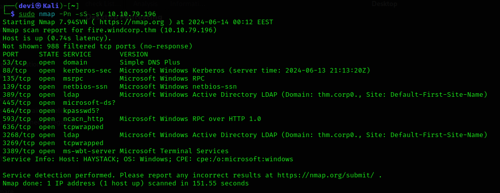

# بسم الله الرحمن الرحيم


It's been a long time since I posted any write-ups here. In this post, I would like to share with you a machine I solved on TryHackMe related to Active Directory called "Reset". I know that many of you do not prefer write-ups to be here, but perhaps it may benefit someone.

---

## Tools and Techniques

### Tools
1. **Nmap**
2. **Smbmap**
3. **Smbclient**
4. **nxc (NetExec)**
5. **impacket-GetNPUsers**
6. **john && Hashcat**
7. **ntlm_theft**
8. **responder**
9. **evil-winrm**
10. **bloodhound-python & bloodhound**
11. **net rpc**
12. **impacket-getST**
13. **impacket-wmiexec**

### Techniques
#### Initial Access
- Leveraging open SMB with null session
- LLMNR/NetBIOS poisoning techniques
- Using evil-winrm to gain initial access

#### Privilege Escalation
- Leveraging Bloodhound to identify compromised users
- Abusing Kerberos Constrained Delegation
- Service Ticket Requests
- Pass-the-ticket
---
## Steps

### Scanning & Enumeration

The first thing we do is the Scanning & Enumeration phase. We'll start by identifying the open ports and services on the machine. You can use your preferred tool for this; here, I used `nmap`.

After performing the scan, you will find that port 445 is open, along with port 88 (which is related to Kerberos) and the LDAP port. We will also find a domain named `thm.corp`. The first thing you should do is add this domain to your `/etc/hosts` file.


## Enumeration

From here, the Enumeration phase begins. Since we found that the SMB port is open, we'll try to obtain a null session.


 We were able to get a session with `SMBClient`. Let's use `smbmap` to list the shared folders and their permissions. We will find that we have access to a folder named `Data` and also have Read & Write permissions on it.

```bash
# Example command to run smbmap
smbmap -H <IP_ADDRESS>
```

Let's continue with the Enumeration phase. Since we are dealing with a Domain Controller, let's enumerate the users in the Domain. We might find a user with PreAuth disabled, allowing us to get the password hash from the TGT and crack it. Here, I used `NetExec`, which performs the same function as `CrackMapExec`. Note that `CrackMapExec` is no longer supported, but that's not our focus right now.

```bash
# Example command to enumerate users with NetExec
nxc -d thm.corp -u "" -p "" --users
```
If we find a user with PreAuth disabled, we can use impacket-GetNPUsers to get the password hash and then crack it using john or Hashcat.
```bash
# Example command to get password hash using impacket-GetNPUsers
impacket-GetNPUsers thm.corp/ -no-pass

# Example command to crack the hash using john
john --wordlist=/path/to/wordlist hash.txt
 ```

After getting a list of users and saving them to a file, I used a simple regex to extract just the usernames. Next, I used `GetNPUsers`, a tool within the Impacket suite, to find users without PreAuth enabled (i.e., users who do not require Kerberos PreAuthentication) and saved the hashes. We will then start cracking these hashes using `john` or `hashcat`.

```bash
# Example command to extract usernames using regex
grep -oP 'username_regex' users_list.txt > usernames.txt

# Example command to get users with PreAuth disabled using GetNPUsers
impacket-GetNPUsers -dc-ip <DC_IP> thm.corp/ -usersfile usernames.txt -format john -outputfile hashes.txt

# Example command to crack the hashes using john
john --wordlist=/path/to/wordlist hashes.txt

# Example command to crack the hashes using hashcat
hashcat -m 18200 -a 0 hashes.txt /path/to/wordlist
```

After we cracked the password for the user `TABATHA_BRITT`, who did not have PreAuth enabled, we tried to gain initial access to the machine using `evil-winrm`. Unfortunately, the user did not have the permissions for that.

But we won’t stop here. Remember the SMB session and the folder we had permissions on? Let’s go back and check what’s inside. After connecting to the folder using `SmbClient`, we’ll find a folder named `onboarding`. Inside this folder, there are 3 files that we’ll download to our machine and open. But before doing that, I want to point out that these files are renamed every 30 seconds or less. This indicates that a user is accessing this folder, opening the files, and renaming them. We’ll see how we can benefit from this information shortly.

After downloading and opening the files, you’ll find credentials for a user named `LILY_ONEILL`. However, we still couldn’t gain access using WinRM with this user. So, let’s go back to the user who is renaming the files.

 Since we have write access to the folder, what would happen if we try to place a shortcut file of our own? When the folder is opened, the usesr would authnticate to our machine, and the user who opens  the folder that cotains the shortcut would attempt to authenticate with us, allowing us to capture their hash. This is essentially LLMNR-NetBIOS Poisoning.

To achieve this, there is a tool called `NTLM_Theft` that generates various file types, such as HTML, XLSX, or DOC, and includes macros and other formats. We could discuss this topic in more detail in a separate post.

The important part is to upload these files, open a new tab, and run `Responder` to capture the connection and the password hash.

 Indeed, after uploading the files, we managed to get the hash for a user named `automate`, which was the result of the LLMNR-NetBIOS Poisoning.

 Next, we need to crack this password.
 
  
After we managed to get the password, let’s try to obtain a shell using `evil-winrm`. Fortunately, this user had the necessary permissions for that, and we successfully obtained the first flag.


---
### privilege escalation
Now we come to the privilege escalation phase. I won’t discuss the amount of enumeration I did with `ADModule` and `Powerview`, or the attempts to run `PowerUp`, as this is not the focus of the post and there were many issues with PowerShell on this machine. What I did instead was run `BloodHound`.

After collecting data using `bloodhound-python`, we import it into `BloodHound` for analysis. We start by marking the users we've identified as "Owned" and analyze their access rights. Through extensive enumeration, we discovered that the user `TABATHA_BRITT`, from whom we initially obtained the password, has `Generic All` rights on another user, `SHAWNA_BRAY`. Additionally, this user has `ForceChangePassword` rights on `CRUZ_HALL`, and `CRUZ_HALL` has `GenericWrite` rights on `DARLA_WINTERS`. 

`DARLA_WINTERS` is a service account with an SPN and has constrained delegation for CIFS. 

` Delegation allows a service to act on behalf of a user to access other services with the user’s permissions. There are three types of delegation; in this case, we have constrained delegation. Constrained delegation means that the service can only delegate the user's credentials to specific services, rather than all services.` 

After performing the lateral movement and sequentially changing the passwords for each user as per the BloodHound analysis, we will abuse the rights accordingly. I used `net rpc` to change the passwords for each user.

 Eventually, we reach the user with "Allowed to Delegate" rights. For this, we can use an Impacket tool named `GetST`, which allows us to perform impersonation on a service where delegation is allowed.

The `GetST` tool works as follows:
1. It first requests a Ticket Granting Ticket (TGT) for the user allowed to delegate, which in our case is `DARLA_WINTERS`.
2. It then uses this TGT to request a Ticket Granting Service (TGS) from the Key Distribution Center (KDC) for the user we want to impersonate, which in this case is the `administrator`.

By impersonating the `administrator`, we can export the TGS we obtained. With this, we gain access to the machine using `Wmiexec`, and thus, we have achieved the second and final flag.
  
And that’s it you’ve captured all the flags on the machine. However, you might want to experiment with persistence methods and practice them as you see fit.


